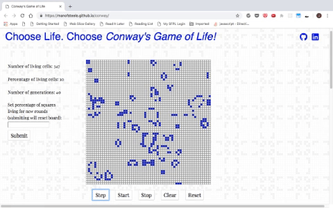

# Conway's Game of Life

[Live site](https://manofsteele.github.io/conway)

[Wikipedia on Conway's game of life](https://en.wikipedia.org/wiki/Conway%27s_Game_of_Life)

## Background

Conway's Game of Life is not a game in the usual sense of the word. The only
"player" is the computer. The game takes place on a two-dimensional grid of squares,
each of which is one of two colors. One of these colors is designated as "alive",
and the others are called "dead" squares. A simple set of rules governs the state
of the board; whether a square is alive or dead in the next round depends on the
number of its neighbors that are alive. Unusual and interesting patterns form,
some lasting briefly, others a long time, and others persist seemingly without end.



## Technology

This version is a simple implementation of the grid game, with a random
set of 50% of the squares set to alive at the beginning. The grid is
"toroidal" -- that is, squares at one edge have those on the opposite edge
counted as neighbors for the purposes of the game, and formations that move
across the edge and creep back onto the grid at the other end of the grid.

This project is be implemented in Javascript, HTML and CSS. The logic of the game
is contained in a single script. The board is stored in a plain JavaScript object,
with properties for the grid and other values needed for the game:

```javascript
let board = {
  grid: grid,
  numLiving: 0,
  numGenerations: 0,
  size: grid.length * grid.length,
  staticGenerations: 0,
  percentage: 50,
  timer: null
};
```

The redrawing algorithm iterates over each square in the grid, and assembles an array 
of all eight of its neighbors. Each cell in the grid has either a value of 0 (dead) or 
1 (living). These are added up, and the cell's value in the next stage of the game is 
determined: 

```javascript
if (board.grid[i][j] === 0) {
  sum === 3 ? nextBoard.grid[i][j] = 1 : nextBoard.grid[i][j] = 0;
} else {
  switch (sum) {
    case 0: case 1:
      nextBoard.grid[i][j] = 0;
      break;
    case 2: case 3:
      nextBoard.grid[i][j] = 1;
      break;
    default:
      nextBoard.grid[i][j] = 0;
  }
  board.numLiving++;
}
```
This algorithm is fine for a small implentation like this one, and it is the easiest to implement; to achieve better performance on a larger grid, other, more efficient algorithms should be considered. 

## Features

* There is a short explanation of the game's rules and history.

* The user can use buttons to start, stop, step one generation, clear the board, and reset the board.

* The user can set the percentage of living tiles at the beginning of each round.

* The application calculates the number and percentage of living cells
and displays them for the user, along with the number of generations.


## Projected features

The possible directions for development are many:

* The user could be given the option to change the size of the grid.
* Some of the more frequently-occurring "shapes" could be placed on the
board to begin with.
* The user could be allowed to place long-lived starting configurations
("methuselahs") on the board.
* The rules could be altered slightly to demonstrate how such
small changes can have large effects.
* The colors of the grid could change periodically.
* The user could vary the speed of the generations
* The user could be given the option to set a starting configuration by
clicking on the tiles.
* The redrawing algorithm could be optimized. Now, it checks each neighbor of each tile. This is not necessary for the "deader" regions of
the board; better algorithms exist. The user could be given the option
of different algorithms to compare their performance.
* The board currently wraps; this does change how the game works. It
could be set to have a hard border of "dead" cells, or altered to have
hidden outer regions.
